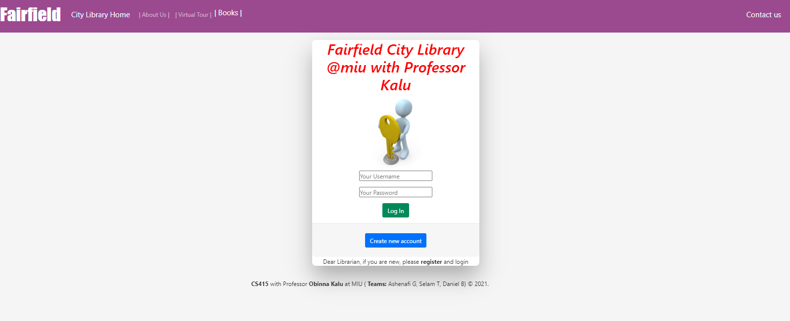
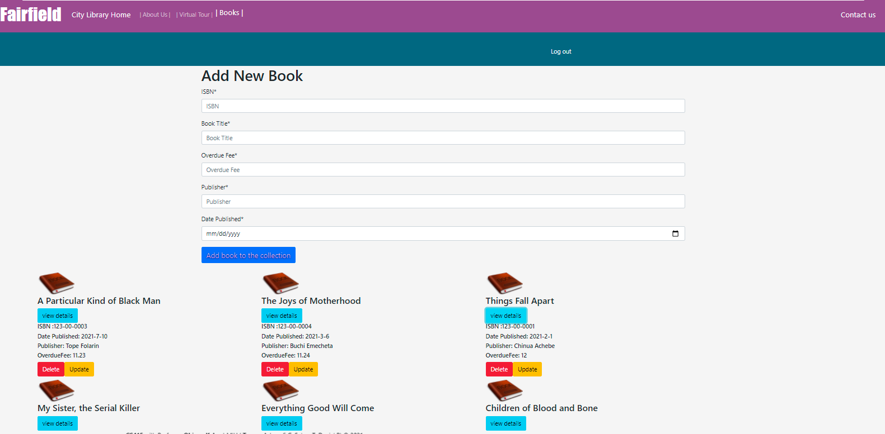
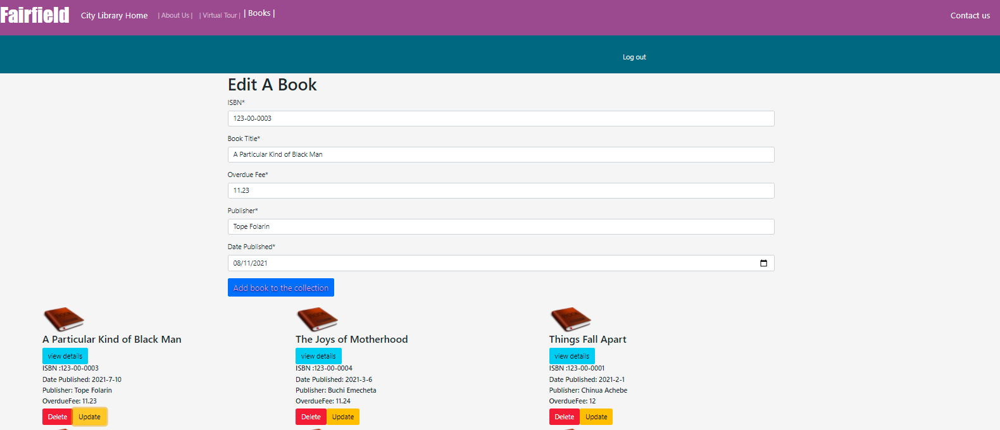
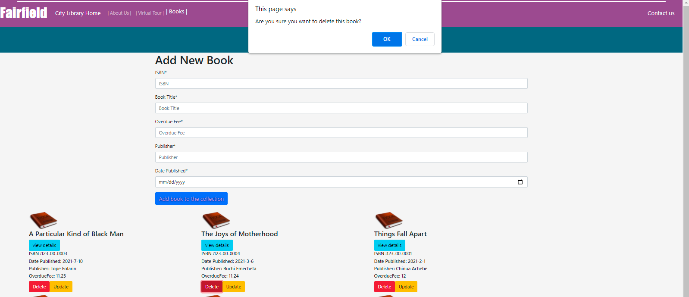
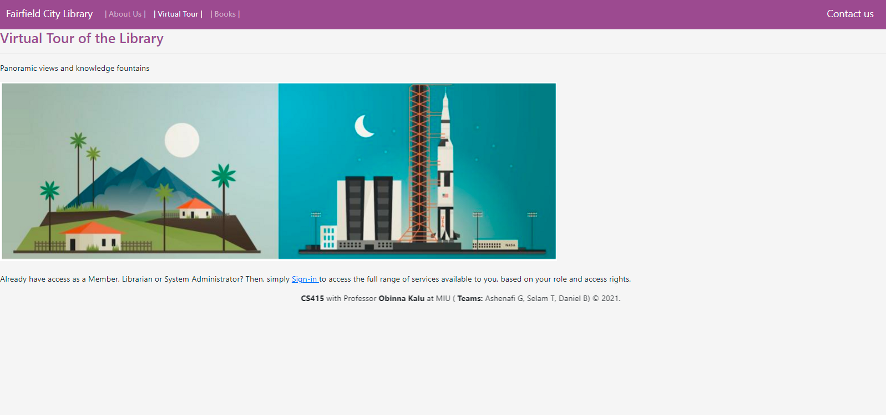
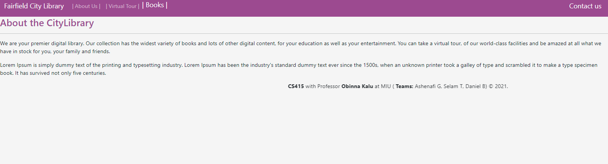

# This is City Library end to end web application project for the course CS415 Relational and Document-Based Databases

## With Professor Obinna Kalu @ [Maharishi International University](https://library.miu.edu/)

### Group memebers:
    #### Ashenafi Gebretekle
    #### Selam Teklehaimanot 
    #### Danial Berhe
    
### Languages we have used:

### You can find our source code in the below repository:

##  [Fairfield City Library](https://github.com/Ashe-Gebre/CS415-Project)
 
#### Feel free to clone & use it after installing the necessary modules.

## Our web page looks like:

 #### Home page
 
 
  #### To add a new book
 
 
  #### To edit a book
 
 
  #### To delete a book
 
 
  #### Virtual tour 
 
 
   #### About us
 

### We would like to thank our professor (Obinna Kalu) for giving us this opprtunity to practice what we have learnt in class.

#### Group members ( Ashenafi A, Selam T and Danial B )

##### August 2021

